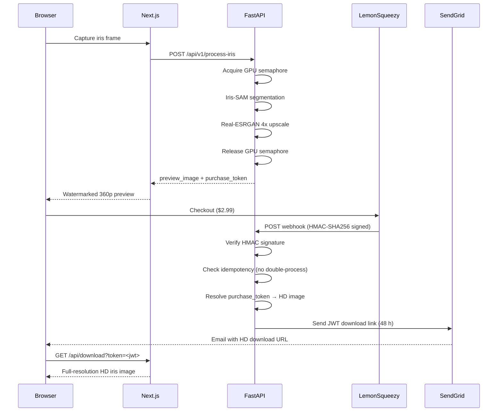

# 👁️ Eyedentity — AI Iris Enhancement Platform

> Transform your iris into stunning, high-resolution art using AI-powered segmentation and upscaling.


---

## ✨ Features

- **Real-time Iris Detection** — MediaPipe-powered eye tracking with quality guidance
- **AI Segmentation** — Iris-SAM (Segment Anything Model fine-tuned for iris)
- **4x AI Upscaling** — Real-ESRGAN for crystal-clear enhancement
- **Mobile-First UX** — Optimized for phone cameras with auto-capture
- **Payment Integration** — Lemon Squeezy for HD image purchases
- **Email Delivery** — SendGrid sends JWT-signed download links post-payment

---

## 🛠️ Tech Stack

| Component | Technology |
|-----------|------------|
| Frontend | Next.js 14, TypeScript, TailwindCSS |
| Backend | FastAPI 0.115, Python 3.12, Uvicorn |
| AI Models | Iris-SAM (SAM fine-tuned), Real-ESRGAN x4v3 |
| Detection | MediaPipe Face Mesh |
| Payments | Lemon Squeezy |
| Email | SendGrid |

---

## 🏗️ Architecture

### Component Overview

```
┌─────────────────────────────────────────────────────────────────┐
│  Browser (Mobile / Desktop)                                     │
│  MediaPipe Face Mesh — real-time iris detection & quality gate  │
└────────────────────┬────────────────────────────────────────────┘
                     │ HTTPS
                     ▼
┌─────────────────────────────────────────────────────────────────┐
│  Next.js 14  (Vercel)                                           │
│  /capture → /result pages                                       │
│  Forwards iris frame to FastAPI, renders watermarked preview    │
└────────────────────┬───────────────────────────┬────────────────┘
     POST /api/v1/process-iris                   │ Checkout redirect
                     │                           ▼
                     ▼                  ┌─────────────────┐
┌────────────────────────────────┐      │  Lemon Squeezy  │
│  FastAPI 0.115  (Railway/Render│      │  (payment)      │
│  ┌──────────────────────────┐  │      └────────┬────────┘
│  │ GPU Semaphore (asyncio)  │  │               │ HMAC-signed
│  │ — serialises AI workload │  │               │ webhook POST
│  │ — prevents OOM on GPU    │  │               ▼
│  └──────────┬───────────────┘  │  POST /api/webhooks/lemon-squeezy
│             │                  │      │
│  Iris-SAM segmentation         │      │ verified → stores purchase_token
│  Real-ESRGAN 4x upscale        │      │
│             │                  │      ▼
│  returns:   │  preview_image   │  ┌──────────────────────────────┐
│             │  purchase_token  │  │  SendGrid                    │
│             └──────────────────┘  │  JWT-signed download link    │
│                                   │  (48 h expiry, email only)   │
└───────────────────────────────────┴──────────────────────────────┘
```

### Purchase & Delivery Sequence



### Key Design Decisions

| Decision | Reason |
|---|---|
| **GPU semaphore** | SAM + ESRGAN together require ~4 GB VRAM. Semaphore (capacity=1) serialises requests — prevents OOM crashes under concurrent load. |
| **purchase_token** | Opaque short-lived token ties a specific processed iris to a payment. Backend resolves token → HD bytes only after webhook confirms payment. |
| **HMAC-signed webhook** | Rejects any unsigned or tampered webhook from LemonSqueezy — prevents fraudulent HD image delivery. |
| **JWT download link** | Stateless, expiring (48 h), email-delivered. User can re-download without re-purchasing within the window. |
| **Watermarked 360p preview** | Free tier — gives user confidence in the result before paying. Never exposes HD pixels pre-payment. |

---

## 🚀 Quick Start (Local Development)

### Prerequisites

- Node.js 18+
- Python 3.12+
- GPU recommended (MPS on Apple Silicon, CUDA on NVIDIA, or CPU)
- [`mkcert`](https://github.com/FiloSottile/mkcert) for local HTTPS

### 1. Clone & Install Frontend

```bash
git clone https://github.com/pnsw123/fixed-iris-project.git
cd fixed-iris-project
npm install
```

### 2. Install Backend

```bash
cd backend
python -m venv venv
source venv/bin/activate        # Windows: venv\Scripts\activate
pip install -r requirements.txt
```

### 3. Download AI Model Weights

Model weight files are excluded from the repo (`.gitignore` excludes `*.pt`, `*.pth`, `*.onnx`, `backend/models/**`). Download them manually and place in `backend/models/`:

```bash
mkdir -p backend/models
```

| File | Download | Description |
|------|----------|-------------|
| `IrisSAM_model.pt` | [HuggingFace — Iris-SAM](https://huggingface.co/) | Fine-tuned SAM for iris segmentation |
| `sam_vit_b_01ec64.pth` | [Meta SAM releases](https://github.com/facebookresearch/segment-anything#model-checkpoints) | SAM ViT-B base checkpoint |
| `realesr-general-x4v3.pth` | [Real-ESRGAN releases](https://github.com/xinntao/Real-ESRGAN/releases) | Real-ESRGAN x4 upscaler |

After downloading:

```
backend/
└── models/
    ├── IrisSAM_model.pt
    ├── sam_vit_b_01ec64.pth
    └── realesr-general-x4v3.pth
```

> **Note:** `sam_vit_b_01ec64.pth` is the base SAM checkpoint. The backend auto-detects backbone type from the fine-tuned weights (`SAM_MODEL_TYPE=auto`). Only override if you know the specific backbone version.

### 4. Set Up SSL (Local HTTPS)

MediaPipe and camera APIs require HTTPS even on localhost.

```bash
# Install mkcert
brew install mkcert         # macOS
# or: https://github.com/FiloSottile/mkcert#installation

# Create local CA and generate certs
mkcert -install
mkdir -p .cert
mkcert -key-file .cert/localhost-key.pem -cert-file .cert/localhost.pem localhost 127.0.0.1 ::1
```

### 5. Configure Environment Variables

**Frontend** — create `.env.local` in project root:

```env
NEXT_PUBLIC_BACKEND_URL=https://localhost:8000
NEXT_PUBLIC_LEMONSQUEEZY_CHECKOUT_URL=https://your-store.lemonsqueezy.com/checkout/buy/YOUR_VARIANT_ID
```

**Backend** — create `.env` inside `backend/`:

```env
# === REQUIRED ===

# Lemon Squeezy — get from Dashboard > Settings > Webhooks
# Webhook URL to enter in Lemon Squeezy dashboard: https://<your-backend-url>/api/webhooks/lemon-squeezy
LEMONSQUEEZY_WEBHOOK_SECRET=your_webhook_signing_secret

# SendGrid — get from app.sendgrid.com > API Keys
SENDGRID_API_KEY=SG.xxxxxxxxxxxxxxxxxxxx

# JWT — random secret for signing download links (use: openssl rand -hex 32)
JWT_SECRET_KEY=change-this-to-a-random-secret

# === OPTIONAL (safe defaults shown) ===

# Public URL of your frontend (used in email download links)
BASE_URL=https://localhost:3000

# From-address for SendGrid emails
FROM_EMAIL=downloads@eyedentity.com

# Compute device: mps (Apple Silicon), cuda (NVIDIA), cpu
DEVICE=mps

# Backend server
HOST=0.0.0.0
PORT=8000

# Model file paths (relative to backend/)
IRIS_SAM_MODEL=./models/IrisSAM_model.pt
SAM_CHECKPOINT=./models/sam_vit_b_01ec64.pth
SAM_MODEL_TYPE=auto
ESRGAN_MODEL=./models/realesr-general-x4v3.pth

# Logging level: DEBUG, INFO, WARNING, ERROR
LOG_LEVEL=INFO
```

### 6. Run

**Backend:**

```bash
cd backend
source venv/bin/activate
python app.py
# API: https://localhost:8000
```

**Frontend (separate terminal):**

```bash
npm run dev
# App: https://localhost:3000
```

---

## 🔧 Environment Variables Reference

### Frontend (`.env.local`)

| Variable | Required | Default | Description |
|---|---|---|---|
| `NEXT_PUBLIC_BACKEND_URL` | **Yes** | — | Full URL of FastAPI backend (e.g. `https://localhost:8000` or Railway URL) |
| `NEXT_PUBLIC_LEMONSQUEEZY_CHECKOUT_URL` | **Yes** | — | Lemon Squeezy checkout URL for HD image purchase |

### Backend (`backend/.env`)

| Variable | Required | Default | Description |
|---|---|---|---|
| `LEMONSQUEEZY_WEBHOOK_SECRET` | **Yes** | — | HMAC signing secret from Lemon Squeezy dashboard → Webhooks |
| `SENDGRID_API_KEY` | Yes (email) | — | SendGrid API key for sending download emails after payment |
| `JWT_SECRET_KEY` | **Yes (prod)** | `dev-secret-key-change-in-production` | Secret for signing JWT download tokens. **Change in production.** |
| `BASE_URL` | No | `https://localhost:3000` | Public frontend URL — embedded in email download links |
| `FROM_EMAIL` | No | `downloads@eyedentity.com` | Sender address for download emails (must be verified in SendGrid) |
| `DEVICE` | No | `mps` | Compute device for AI models: `mps`, `cuda`, or `cpu` |
| `HOST` | No | `0.0.0.0` | Uvicorn bind address |
| `PORT` | No | `8000` | Uvicorn port |
| `IRIS_SAM_MODEL` | No | `./models/IrisSAM_model.pt` | Path to Iris-SAM fine-tuned weights |
| `SAM_CHECKPOINT` | No | `./models/sam_vit_b_01ec64.pth` | Path to base SAM ViT-B checkpoint |
| `SAM_MODEL_TYPE` | No | `auto` | SAM backbone: `auto`, `vit_b`, `vit_l`, or `vit_h` |
| `ESRGAN_MODEL` | No | `./models/realesr-general-x4v3.pth` | Path to Real-ESRGAN x4v3 weights |
| `LOG_LEVEL` | No | `INFO` | Python logging level |
| `CORS_ORIGINS` | No | See config.py | JSON array of allowed CORS origins |

---

## 📦 Deployment

### Frontend → Vercel

1. Push repo to GitHub.
2. Import project at [vercel.com/new](https://vercel.com/new).
3. Set **Framework Preset** to `Next.js`.
4. Add environment variables under **Project Settings → Environment Variables**:
   - `NEXT_PUBLIC_BACKEND_URL` — your Railway/Render backend URL
   - `NEXT_PUBLIC_LEMONSQUEEZY_CHECKOUT_URL`
5. Deploy. Vercel handles SSL automatically.

> **HTTPS note:** Vercel deployments are always HTTPS. Update `BASE_URL` in backend to match your Vercel domain.

---

### Backend → Docker

**Build image:**

```bash
# From project root
docker build -f backend/Dockerfile -t eyedentity-backend .
```

**Sample `backend/Dockerfile`:**

```dockerfile
FROM python:3.12-slim

WORKDIR /app

# Install system deps for OpenCV
RUN apt-get update && apt-get install -y \
    libglib2.0-0 libsm6 libxext6 libxrender-dev libgl1 \
    && rm -rf /var/lib/apt/lists/*

COPY backend/requirements.txt .
RUN pip install --no-cache-dir -r requirements.txt

COPY backend/ .

# Mount model weights at runtime (they are gitignored)
# docker run -v /path/to/models:/app/models ...

EXPOSE 8000
CMD ["python", "app.py"]
```

**Run container:**

```bash
docker run -p 8000:8000 \
  -v $(pwd)/backend/models:/app/models \
  -e LEMONSQUEEZY_WEBHOOK_SECRET=your_secret \
  -e SENDGRID_API_KEY=SG.xxx \
  -e JWT_SECRET_KEY=your_jwt_secret \
  -e DEVICE=cpu \
  eyedentity-backend
```

---

### Backend → Railway

1. Create new project at [railway.app](https://railway.app).
2. Connect your GitHub repo.
3. Set **Root Directory** to `backend/`.
4. Railway auto-detects Python. Add a `Procfile` in `backend/`:
   ```
   web: python app.py
   ```
5. Set environment variables in Railway dashboard (all vars from the table above).
6. Mount model weights: upload to a Railway Volume or external storage (S3/R2) and set `IRIS_SAM_MODEL`, `SAM_CHECKPOINT`, `ESRGAN_MODEL` to those paths.
7. Set `PORT` to `$PORT` (Railway injects this automatically).

---

### Backend → Render

1. Create new **Web Service** at [render.com](https://render.com).
2. Connect repo, set **Root Directory** to `backend/`.
3. **Build Command:** `pip install -r requirements.txt`
4. **Start Command:** `python app.py`
5. Add all env vars in Render dashboard.
6. For model weights, use a Render Disk or download from external storage in a startup script.

---

### SSL Certificate Setup (Local Dev)

Local dev requires HTTPS for browser camera APIs.

```bash
# 1. Install mkcert
brew install mkcert          # macOS
winget install mkcert        # Windows
apt install mkcert           # Ubuntu/Debian

# 2. Install local CA into system/browser trust stores
mkcert -install

# 3. Generate certs for localhost
mkdir -p .cert
mkcert -key-file .cert/localhost-key.pem \
       -cert-file .cert/localhost.pem \
       localhost 127.0.0.1 ::1

# 4. Next.js reads certs from .cert/ automatically (see next.config.ts)
```

> `.cert/` is gitignored — each developer generates their own local certs.

---

## 📁 Project Structure

```
├── src/                        # Next.js frontend
│   ├── app/                   # Pages (instructions, capture, result)
│   ├── components/            # React components
│   └── lib/                   # Utilities (quality metrics, audio)
├── backend/                   # FastAPI backend
│   ├── api/                  # Routes (webhooks, downloads)
│   ├── services/             # AI services (Iris-SAM, ESRGAN, email)
│   ├── models/               # AI model weights (gitignored — download manually)
│   ├── config.py             # Pydantic settings (all env vars)
│   └── app.py                # FastAPI entry point
└── .cert/                     # SSL certs for local HTTPS (gitignored)
```

---

## 📱 User Flow

1. **Instructions** → Learn how to position eye
2. **Capture** → AI guides positioning, auto-captures when quality threshold met
3. **Enhance** → Iris-SAM segments iris, ESRGAN upscales 4x
4. **Preview** → 360p watermarked preview shown immediately (free)
5. **Purchase** → Lemon Squeezy checkout ($2.99)
6. **Download** → HD image delivered via Lemon Squeezy webhook → email link

---

## 🔒 Security Notes

- GPU semaphore prevents concurrent request OOM crashes
- Thread-safe purchase storage with `threading.Lock()`
- HMAC-SHA256 webhook signature verification (rejects unsigned requests)
- Webhook idempotency tracking (prevents double-processing)
- JWT-signed download tokens (48h expiry)
- HTTPS-only — never run frontend on plain HTTP

---

## 🛠 Troubleshooting

Common failure modes, causes, and fixes for new developers.

| # | Symptom | Cause | Fix |
|---|---------|-------|-----|
| 1 | **Camera permission denied / camera not starting** | Browser blocks `getUserMedia` on plain HTTP | Run frontend on HTTPS (see step 4 — SSL setup). Never use `http://localhost`. |
| 2 | **Backend crashes on startup with `FileNotFoundError`** | Model weights missing from `backend/models/` or file name mismatch | Download all three weight files and verify exact names: `IrisSAM_model.pt`, `sam_vit_b_01ec64.pth`, `realesr-general-x4v3.pth`. See Step 3 of Quick Start. |
| 3 | **`AttributeError: module 'torchvision.transforms.functional_tensor' has no attribute 'rgb_to_grayscale'`** | torchvision ≥ 0.16 moved `rgb_to_grayscale` out of `functional_tensor` | Add the compatibility shim below. |
| 4 | **CORS error in browser console** (`Access-Control-Allow-Origin` missing) | Backend `CORS_ORIGINS` list does not include the frontend origin (e.g. `https://localhost:3005`) | Set `CORS_ORIGINS` in `backend/.env` to include your frontend port. See example below. |
| 5 | **SSL certificate not trusted / browser shows "Your connection is not private"** | `mkcert -install` step was skipped — local CA not in system trust store | Run `mkcert -install` once, then re-generate certs and restart the browser. |

### Fix 3 — torchvision compatibility shim

Add this near the top of `backend/app.py` (before any torchvision import):

```python
# torchvision ≥ 0.16 compatibility shim
import torchvision.transforms.functional as _F
import types as _types

if not hasattr(_types.ModuleType, "_functional_tensor_shim_applied"):
    import sys
    _ft = sys.modules.get("torchvision.transforms.functional_tensor")
    if _ft is None:
        import torchvision.transforms.functional as _ft  # type: ignore
    if not hasattr(_ft, "rgb_to_grayscale"):
        _ft.rgb_to_grayscale = _F.rgb_to_grayscale
```

### Fix 4 — CORS origins for non-default port

In `backend/.env`, set `CORS_ORIGINS` to a JSON array that includes every origin your frontend uses:

```env
CORS_ORIGINS=["https://localhost:3000","https://localhost:3005","https://127.0.0.1:3000"]
```

> **Tip:** If you change the Next.js dev port via `--port`, you must add that origin here or every API call will be blocked by the browser.

### Fix 5 — SSL cert not trusted

```bash
# Run once per machine — installs local CA into system/browser trust stores
mkcert -install

# Then regenerate certs
mkdir -p .cert
mkcert -key-file .cert/localhost-key.pem \
       -cert-file .cert/localhost.pem \
       localhost 127.0.0.1 ::1

# Restart your browser completely (not just the tab)
```

> On macOS you may also need to open **Keychain Access → System**, find the `mkcert` certificate, and set it to **Always Trust**.

---

## 🧪 Running Tests

### Frontend

```bash
npm test           # run once
npm run test:watch # watch mode
```

### Backend

```bash
cd backend
source venv/bin/activate          # Windows: venv\Scripts\activate
pytest                            # all tests
pytest -m "not integration"       # unit tests only
```

### Test structure

| Layer | Location | Runner |
|-------|----------|--------|
| Frontend unit | `src/tests/` | Vitest |
| Backend unit | `backend/tests/` | pytest |
| E2E | `e2e/` (planned) | Playwright |

---

## 🤝 Contributing

1. **Fork** the repo and create a feature branch: `git checkout -b feat/your-feature`
2. **Make changes** — follow the existing code style
3. **Add tests** — every new function or component needs a corresponding test file
4. **Open a PR** — CI must pass (type-check, lint, unit tests) before merge

> Pull requests with failing CI will not be merged. Run `npm test` (frontend) and `pytest` (backend) locally before pushing.

---

## 📄 License

Private repository — All rights reserved.
